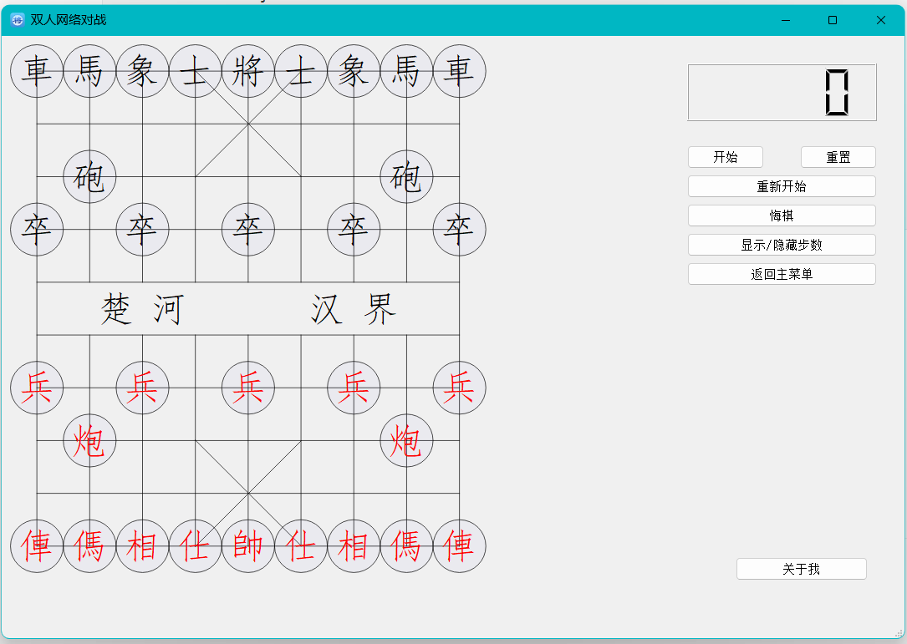

# Chinese-Chess

中国象棋初版

实现了单人双方对战、人对战电脑、开两个客户端联机对战

```cobol
佛曰:
 *          写字楼里写字间，写字间里程序员；
 *          程序人员写程序，又拿程序换酒钱。
 *          酒醒只在网上坐，酒醉还来网下眠；
 *          酒醉酒醒日复日，网上网下年复年。
 *          但愿老死电脑间，不愿鞠躬老板前；
 *          奔驰宝马贵者趣，公交自行程序员。
 *          别人笑我忒疯癫，我笑自己命太贱；
 *          不见满街漂亮妹，哪个归得程序员？
```

## 运行环境

C:\Users\userName> qmake --version
QMake version 3.1
Using Qt version 5.14.2

## 界面展示

### 主菜单界面：


主界面部分代码：

```c++
#include "choosemainwindow.h"

ChooseMainWindow::ChooseMainWindow(QWidget *parent) : QDialog(parent)
{
    this->setWindowTitle("选择游戏方式");
    this->setFixedSize(250,120);
    this->setWindowIcon(QIcon(":/images/chess.svg"));

    QVBoxLayout* lay = new QVBoxLayout(this);
    lay->addWidget(m_buttons[0] = new QPushButton("玩家自己对战"));
    lay->addWidget(m_buttons[1] = new QPushButton("玩家和AI对战"));
    lay->addWidget(m_buttons[2] = new QPushButton("双人网络对战"));

    /*游戏方式一: 自己和自己下棋【同一台PC机器】*/
    connect(m_buttons[0], &QPushButton::clicked,[=](){
        this->hide();
        m_pAgainstYourself = new ChessBoard();
        m_pAgainstYourself->setWindowTitle("玩家自己对战");
        m_pAgainstYourself->show();

        //返回主窗口
        connect(m_pAgainstYourself,&ChessBoard::toMenu,[=](){
            m_pAgainstYourself->close();
            this->show();
        });
    });

    /*游戏方式二: 自己和电脑下棋【同一台PC机器】*/
    connect(m_buttons[1], &QPushButton::clicked,[=](){
        this->hide();

        m_pRobotGame = new RobotGame();
        m_pRobotGame->setWindowTitle("玩家和AI对战");
        m_pRobotGame->show();

        //返回主窗口
        connect(m_pRobotGame,&ChessBoard::toMenu,[=](){
            m_pRobotGame->close();
            this->show();
        });
    });

    /*游戏方式三: 双人局域网下棋【可在局域网下不同台PC机器】*/
    connect(m_buttons[2], &QPushButton::clicked,[=](){
        this->hide();

        QMessageBox::StandardButtons ret = QMessageBox::question(NULL, "提示", "是否作为服务器启动[选择红方]?");

        bool bServer = false;
        if(ret == QMessageBox::Yes)
            bServer = true;

        m_pNetworkGame = new NetworkGame(bServer);
        m_pNetworkGame->setWindowTitle("双人网络对战");
        m_pNetworkGame->show();

        //返回主窗口
        connect(m_pNetworkGame,&ChessBoard::toMenu,[=](){
            m_pNetworkGame->close();
            this->show();
        });
    });
}

```

### 玩家和自己对战界面：


棋盘绘制部分代码：

```c++
void ChessBoard::paintEvent(QPaintEvent *)
{
    QPainter painter(this);
    painter.setRenderHint(QPainter::Antialiasing, true);//渲染提示
    int side = qMin(int(ui->centralwidget->width() - ui->rightWidget->width()), ui->label->height());
    painter.scale(side / 960.0, side / 960.0);
    m_offset = 60;              //距离界面的边距
    m_distance = 90;            //间距为90px
    m_radius = m_distance/2;    //棋子半径为d/2

    for(int i = 0; i <10; i++){
        painter.drawLine(QPoint(m_offset, m_offset+i*m_distance), QPoint(m_offset+8*m_distance, m_offset+i*m_distance));
    }
    for(int i=0; i<9; i++){
        if(i==0 || i==8){
            painter.drawLine(QPoint(m_offset+i*m_distance, m_offset), QPoint(m_offset+i*m_distance, m_offset+9*m_distance));
        }else{
            painter.drawLine(QPoint(m_offset+i*m_distance, m_offset), QPoint(m_offset+i*m_distance, m_offset+4*m_distance));
            painter.drawLine(QPoint(m_offset+i*m_distance, m_offset+5*m_distance), QPoint(m_offset+i*m_distance, m_offset+9*m_distance));
        }
    }

    painter.drawLine(QPoint(m_offset+3*m_distance, m_offset), QPoint(m_offset+5*m_distance, m_offset+2*m_distance));
    painter.drawLine(QPoint(m_offset+3*m_distance, m_offset+2*m_distance), QPoint(m_offset+5*m_distance, m_offset));
    painter.drawLine(QPoint(m_offset+3*m_distance, m_offset+7*m_distance), QPoint(m_offset+5*m_distance, m_offset+9*m_distance));
    painter.drawLine(QPoint(m_offset+3*m_distance, m_offset+9*m_distance), QPoint(m_offset+5*m_distance, m_offset+7*m_distance));

    QRect rect1(m_offset+m_distance,   m_offset+4*m_distance, m_distance, m_distance);
    QRect rect2(m_offset+2*m_distance, m_offset+4*m_distance, m_distance, m_distance);
    QRect rect3(m_offset+5*m_distance, m_offset+4*m_distance, m_distance, m_distance);
    QRect rect4(m_offset+6*m_distance, m_offset+4*m_distance, m_distance, m_distance);
    painter.setFont(QFont("FangSong", m_radius * 5 / 6, 800));
    painter.drawText(rect1, "楚", QTextOption(Qt::AlignCenter));
    painter.drawText(rect2, "河", QTextOption(Qt::AlignCenter));
    painter.drawText(rect3, "汉", QTextOption(Qt::AlignCenter));
    painter.drawText(rect4, "界", QTextOption(Qt::AlignCenter));

    //*******************绘画棋子*******************
    //绘制上次移动棋子的起止位置
    if(m_isShowStep)
        drawLastStep(painter,m_chessSteps);

    for(int i = 0; i < 32; i++)
        drawChessPieces(painter, i);

    //绘制文本棋谱
    drawTextStep();
}
```

### 玩家和AI对战界面：


其实并不算是真正的AI，算法实现的是只要有可以吃到的子，就会直接吃掉，有多个可以吃掉的子，会计算各个棋子的得分，没有就随便走一步。

部分实现代码：

```c++
ChessStep *RobotGame::getBestMove()
{
    int maxScore = -10000;
    ChessStep* retStep = NULL;

    //有可击杀的红棋子就走击杀红棋子最优的一步
    // 1.看看有那些步骤可以走
    QVector<ChessStep*> steps;
    getAllPossibleMoveStep(steps);

    //没有可击杀的红棋子就走最后的一步
    QVector<ChessStep*> stepsAndNoKill;
    getAllPossibleMoveStepAndNoKill(stepsAndNoKill);

    //2.试着走一下
    for(QVector<ChessStep*>::iterator it = steps.begin(); it!=steps.end(); it++)
    {
        ChessStep* step = *it;
        fakeMove(step);
        int score = calcScore();   //3.计算最好的局面分
        unFakeMove(step);

        if(score > maxScore)
        {
            maxScore = score;
            retStep = step;
        }
    }

    if(retStep != NULL)
        return retStep;

    //2.试着走一下
    //从这种不击杀红棋子，只是单纯移动黑棋steps里面，随机抽选一种进行下棋
    int nStepsCount = stepsAndNoKill.count();
    qsrand(QTime(0,0,0).secsTo(QTime::currentTime()));
    int temp =qrand()% nStepsCount;
    QVector<ChessStep*>::iterator it = stepsAndNoKill.begin();
    retStep = it[temp];

    if(retStep == NULL)
        whoWin();

    return retStep;
}
int RobotGame::calcScore()
{
    //enum m_emTYPE{JIANG, SHI, XIANG, MA, CHE, PAO, BING};
    //黑棋分数 - 红棋分数
    int redGrossScore = 0;
    int blackGrossScore = 0;

    static int chessScore[]={200, 20, 40, 60, 100, 80, 10};

    for(int i=0; i<16; i++)
    {
        if(m_chessPieces[i].m_isDead)
            continue;
        blackGrossScore += chessScore[m_chessPieces[i].m_emType];
    }

    for(int i=16; i<32; i++)
    {
        if(m_chessPieces[i].m_isDead)
            continue;
        redGrossScore += chessScore[m_chessPieces[i].m_emType];
    }

    return (blackGrossScore - redGrossScore);
}
void RobotGame::getAllPossibleMoveStep(QVector<ChessStep *> &steps)
{
    for(int id = 0; id<16; id++){
        if(m_chessPieces[id].m_isDead)
            continue;

        for(int row=0; row<10; row++){
            for(int col=0; col<9; col++){
                int i = 16;             //机器人是黑方
                for( ; i <= 31; i++){
                    if(m_chessPieces[i].m_row == row && m_chessPieces[i].m_col == col && m_chessPieces[i].m_isDead == false)
                        break;
                }

                if(i!=32){
                    if(canMove(id, i, row, col))
                        saveStep(id, i, row, col, steps);
                }
            }
        }
    }
}

// 该函数实现了一个棋类游戏中所有未死亡的棋子在棋盘上所有能够不吃子移动的走法的获取
void RobotGame::getAllPossibleMoveStepAndNoKill(QVector<ChessStep *> &steps)
{
    for(int id = 0; id<16; id++){
        if(m_chessPieces[id].m_isDead)
            continue;

        for(int row=0; row<10; row++){
            for(int col=0; col<9; col++){
                int i = 0;
                for( ; i <= 31; i++){
                    if(m_chessPieces[i].m_row == row && m_chessPieces[i].m_col == col && m_chessPieces[i].m_isDead == false)
                        break;
                }

                if(id < 16 && i ==32){//-1??????
                    if(canMove(id, -1, row, col))
                        saveStep(id, -1, row, col, steps);
                }
            }
        }
    }
}
```

### 双人网络对战：




部分代码展示：

```c++
#include "networkgame.h"

NetworkGame::NetworkGame(bool isServer)
{
    m_tcpServer = nullptr;
    m_tcpSocket = nullptr;

    if(isServer){
        m_isTcpServer = true;
        m_tcpServer = new QTcpServer(this);
        m_tcpServer->listen(QHostAddress::Any, 5555);

        connect(m_tcpServer, &QTcpServer::newConnection, this, &NetworkGame::slotNewConnection);
    } else {
        m_isTcpServer = false;
        m_tcpSocket = new QTcpSocket(this);
        m_tcpSocket->connectToHost(QHostAddress("127.0.0.1"), 5555);

        connect(m_tcpSocket, &QTcpSocket::readyRead, this, &NetworkGame::slotRecv);
    }
}

NetworkGame::~NetworkGame()
{

}

void NetworkGame::clickPieces(int id, int row, int col)
{
    if(m_isTcpServer){
        if(m_selectID == -1 && m_checkedID == -1){
            if(m_isTcpServer != m_chessPieces[id].m_isRed)
                return ;
        }
    } else {
        if(m_selectID == -1 && m_checkedID == -1){
            if(m_isTcpServer != m_chessPieces[id].m_isRed)
                return ;
        }
    }

    whoWin();

    ChessBoard::clickPieces(id, row, col);

    char array[3];
    array[0] = id;
    array[1] = row;
    array[2] = col;

    // 如果先创建的客户端，就会报错，因为构造函数没有new QTcpSocket。
    m_tcpSocket->write(array, 3);
}

void NetworkGame::slotNewConnection()
{
    if(m_isTcpServer)
        return ;
    m_tcpSocket = m_tcpServer->nextPendingConnection();
    connect(m_tcpSocket, &QTcpSocket::readyRead, this, &NetworkGame::slotRecv);
}

void NetworkGame::slotRecv()
{
    QByteArray array = m_tcpSocket->readAll();

    int checkedID = array[0];
    int row = array[1];
    int col = array[2];

    ChessBoard::clickPieces(checkedID, row, col);
}


```

## Author

https://github.com/allenmirac/Chinese-Chess

# 巨人的肩膀

[项目实战：Qt5／C++：QT象棋【初版】](https://blog.csdn.net/qq_33154343/article/details/80931400)

[XMuli-ChineseChess](https://github.com/XMuli/ChineseChess)

